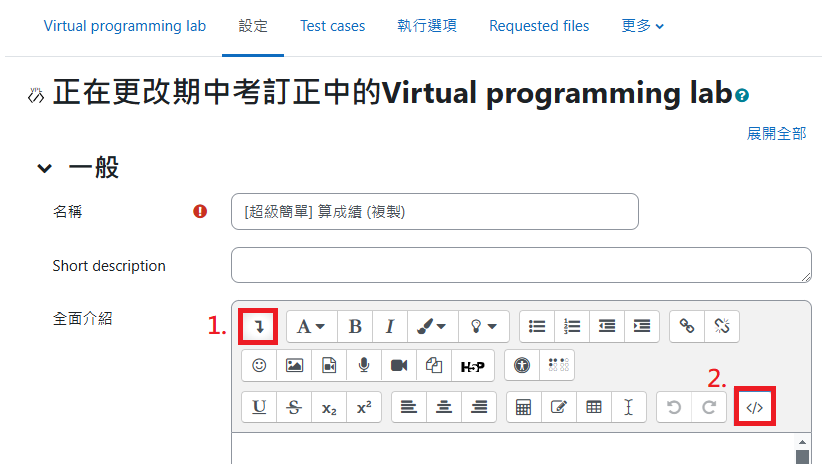
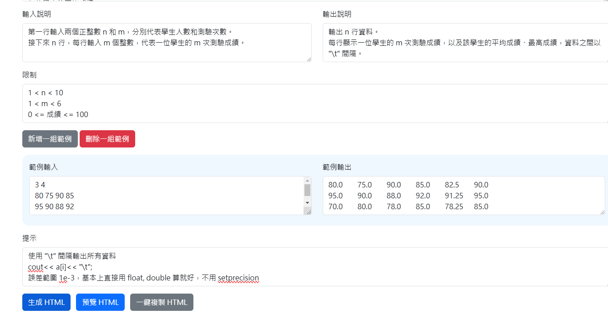
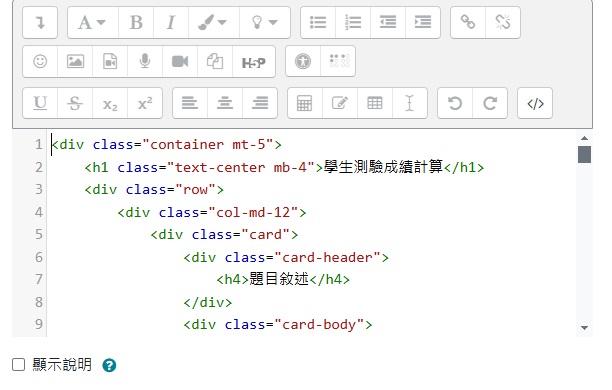

# Question Formatter for Moodle VPL
> format your question description in Moodle Virtual Porgramming Lab

https://clashroyaleisgood.github.io/toolkits/question_formatter/  

## Steps
1. **開啟題目 HTML 編輯器**  
   
2. **至 Question Formatter 填入資料，並生成 HTML**  
   
3. **(預覽 HTML 並) 複製 HTML 至 Moodle 的 HTML 編輯器**  
   
4. 完成!
